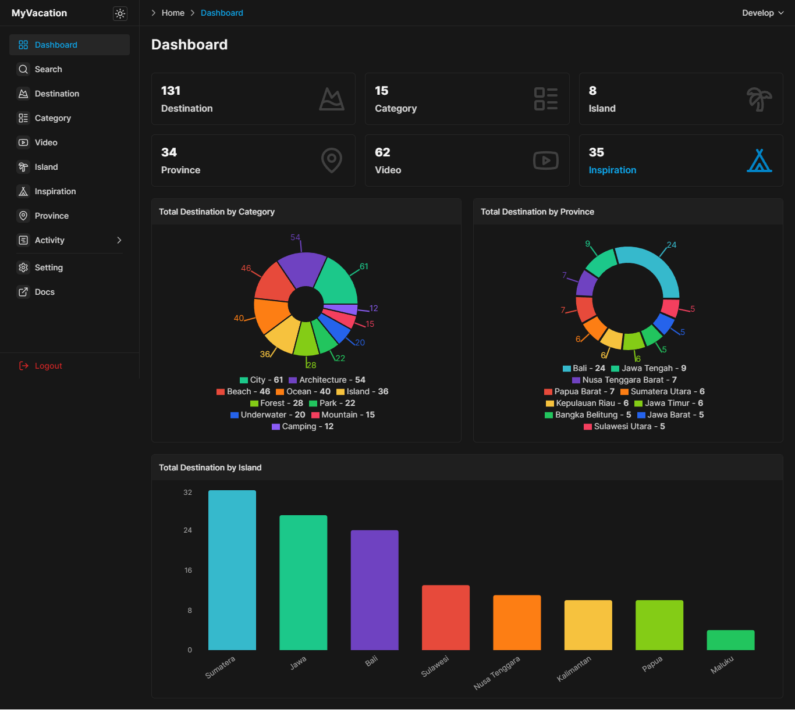

import {
	LogInIcon,
	LogOutIcon,
	SearchIcon,
	PieChartIcon,
	LayoutGridIcon,
	MountainSnowIcon,
	LayoutListIcon,
	YoutubeIcon,
	PalmtreeIcon,
	TentIcon,
	MapPinIcon,
	RssIcon,
} from "lucide-react";

import { Card, Cards } from "@/components/cards";

# Introduction

Welcome to MyVacation REST API documentation. From here you can easily discover all available REST APIs with the required information on how to consume it.

## What is MyVacation?

MyVacation is a digital information about destination, video as well as category, inspiration and other. Explore Indonesia's diverse beauty, culture, and adventure on Indonesia Travel. Plan your journey to this tropical paradise.

Our searchable database includes hundreds of destination, video, inspiration, category and others.

## Database & Schema

- Import data directly from a CSV or excel spreadsheet to **Supabase**.

[CSV](https://github.com/wahid-ari/next-supabase-vacation-docs/tree/master/public/supabase-csv)

- Supabase Schema

[Schema](https://github.com/wahid-ari/next-supabase-vacation-docs/tree/master/public/sql)

- JSON data

[JSON](https://github.com/wahid-ari/next-supabase-vacation-docs/tree/master/public/json)

## Postman

You can import collections or your API specifications directly into Postman.

Export Collection v2.1 > [JSON](/Next_Supabase_Vacation.postman_collection.json)

Export Collection v2.1 > [JSON](https://github.com/wahid-ari/next-supabase-vacation-docs/blob/master/public/Next_Supabase_Vacation.postman_collection.json) (github)

Export Collection v2.1 > [JSON](https://github.com/wahid-ari/next-supabase-vacation-docs/raw/master/public/Next_Supabase_Vacation.postman_collection.json) (download)

## Documentation

Discover our REST API documentation

<Cards>
	<Card
		icon={<LogInIcon className="h-6 w-6" />}
		title="Login"
		href="/auth/login"
	/>
	<Card
		icon={<LogOutIcon className="h-6 w-6" />}
		title="Logout"
		href="/auth/logout"
	/>
	<Card
		icon={<SearchIcon className="h-6 w-6" />}
		title="Search"
		href="/search"
	/>
	<Card
		icon={<PieChartIcon className="h-6 w-6" />}
		title="Statistic"
		href="/statistics"
	/>
	<Card
		icon={<LayoutGridIcon className="h-6 w-6" />}
		title="Dashboard"
		href="/Dashboard"
	/>
	<Card
		icon={<MountainSnowIcon className="h-6 w-6" />}
		title="Destination"
		href="/Destination"
	/>
	<Card
		icon={<LayoutListIcon className="h-6 w-6" />}
		title="Category"
		href="/category"
	/>
	<Card
		icon={<YoutubeIcon className="h-6 w-6" />}
		title="Video"
		href="/video"
	/>
	<Card
		icon={<PalmtreeIcon className="h-6 w-6" />}
		title="Island"
		href="/island"
	/>
	<Card
		icon={<TentIcon className="h-6 w-6" />}
		title="Inspiration"
		href="/inspiration"
	/>
	<Card
		icon={<MapPinIcon className="h-6 w-6" />}
		title="Province"
		href="/province"
	/>
	<Card
		icon={<RssIcon className="h-6 w-6" />}
		title="Sitemap & RSS"
		href="/sitemap-rss"
	/>
</Cards>
